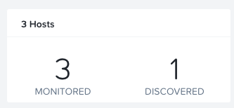
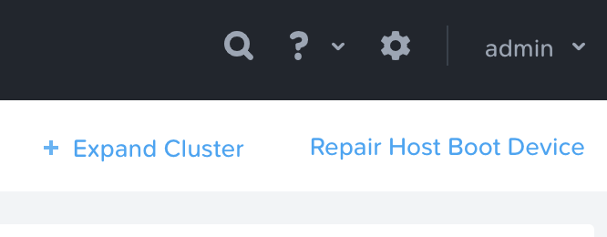
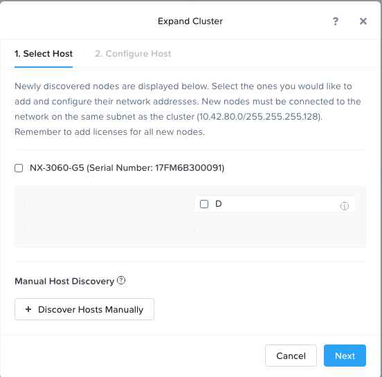
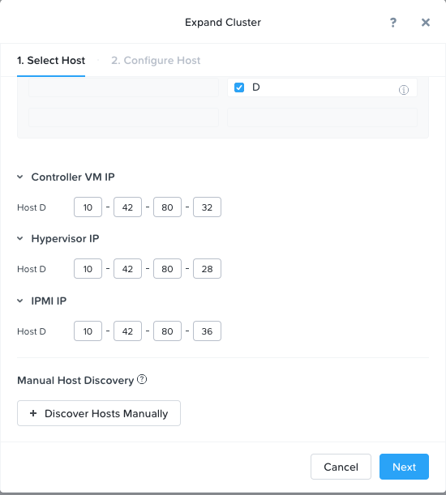
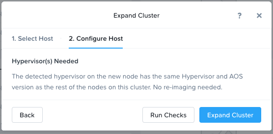
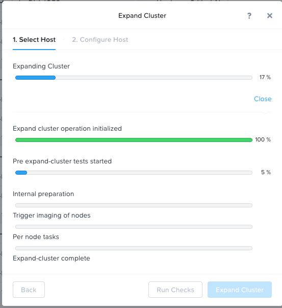
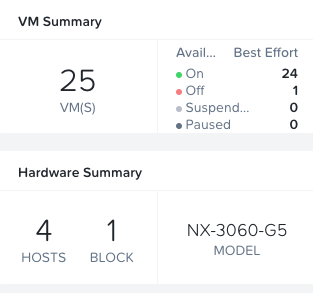

.. _expansion:

------------------------------
Expansion of a Nutanix cluster
------------------------------

*The estimated time to complete this lab is 15 minutes.*

Overview
++++++++
After time the workloads on Nutanix cluster might have been to much for the existing cluster. Expanding an existing cluster is something that will be done once every while by customers.
This lab is created to run exactly that; "How to expand an existing cluster with an extra node". The following shows this in a 2 minutes movie.

.. raw:: html

  <iframe width="640" height="360" src="https://www.youtube.com/embed/M7BzgEJOevc" frameborder="0" allow="accelerometer; autoplay; encrypted-media; gyroscope; picture-in-picture" allowfullscreen></iframe>

Expand the cluster
++++++++++++++++++++++++++++++

The expansion of a cluster is a relatively easy process. Follow the below steps to expand your cluster from a three to a four node cluster.

#. Open \https://<*NUTANIX-CLUSTER-IP*>:9440 in a new browser tab. (Use the :ref:`cluster_assignment` for your *IP address*) and login to the cluster if you haven't already done so.

#. The expansion can be done in a few places in the PRISM interface:
	
	1. From the settings menu (click to **Gear** icon in the top right corner)
	2. Go to the hardware submenu (using the view selector)

	.. figure:: images/expansion-01.png

#. To make sure we can expand the cluster, that there is a node discovered, select Hardware in the menu selector. This should show after a few seconds the below screen.

#. As we are in the hardware submenu, where we also can expand the cluster, click the **+ Expand Cluster** text in the top right corner of the mainscreen.

#. This will, after a few seconds, show the discovered node.

#. Select the node by clicking on or the block (mentions the *type* of the system and the *serialnumber* of the block, like in the below screenshot) or the node (*D*).

#. As the node has already been configured during the foundation process, the IP addresses have already been filled. 

.. note:: Normally these fields need to be populated at time of the expansion at customer's site.

#. Click on the **Next** button to proceed to the next step. Imaging the node if needed.

#. The next screen is showing if a system needs to be reimaged. This can be the case in the following cases:

	1. The AOS on the node is different then what is running in the cluster.
	2. The Hypervisor is the wrong version or hypervisor in general. Example could be an ESXi in an AHV cluster.

#. As this node is already correct, click the **Expand Cluster** button to start the expansion of the cluster process.

#. Some validation will be run first before the actual expansion is run. Wait for the expansion to finish. To see more detailed information abut the expansion, click on the **Open** text. Click on the **Close** button after the process has finished (the button will only appear **AFTER** the process has finished).

#. Now that the expansion process has completed, you *Hardware* and *Home* submenus should show the new node being available and there no discovered nodes available.

Takeaways
+++++++++

What are the key things you should know about **Nutanix Cluster epansion**?

- The cluster is capable of discovering new unconfigured nodes automatically

- The expansion is done in  a few clicks

- The expansion process is capable of reimaging the new node(s) to the correct configuration (AOS and Hypervisor) when needed. This doesn't need any human intervention.
