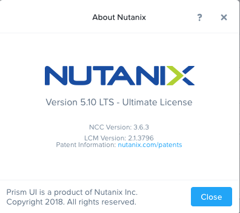
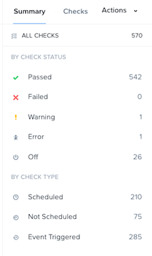

PRISM Overview
++++++++++++++

This module is showing how to:

1. Overview of the PRISM interface
2. Create a storage container
3. Create a virtual network
4. Create VMs and use the just created network and storage

*The estimated time to complete this lab is 60 minutes.*

Prism Element
-------------

The Prism service provides the web UI for managing Nutanix clusters and runs on every Controller VM (CVM). This local Prism service, referred to Prism Element, can be accessed via the IP of any individual CVM, or via the virtual IP for the cluster, which will redirect to the current Prism leader.

#. Log in to https://demo.nutanix.com and click on the AHV cluster you see.

  .. figure:: images/demo.nutanix.com.png

#. Familiarize yourself with the Prism UI. Explore the information on the **Home** screen, as well as the other screens.

#. Review the Home screen, and identify the following items:

   - Hypervisor
   - Version
   - Hardware Model
   - Health
   - VM Summary
   - Warning Alerts
   - Data Resiliency Status

   .. figure:: images/nutanix_tech_overview_02.png

#. Review the UI navigation options under the **View Options** pull-down menu. The label of this menu changes based on the dashboard that is currently displayed. For example, from the Home dashboard it will be labeled **Home**, from the Health dashboard it will be labeled **Health**, etc.

   .. figure:: images/nutanix_tech_overview_03.png

#. Examine the cluster hardware under **Home > Hardware**, click **Hardware**, then click **Diagram**.

#. Review the hardware summary information:

   - Blocks
   - Hosts
   - Memory
   - CPU
   - Disks

   .. figure:: images/nutanix_tech_overview_04.png

   .. note::

     The screenshot above may differ slightly than what is seen in the lab environment.

Prism Element UI Review
-----------------------

Where would you locate the version of AOS you are running?

You can do this by clicking on the **username** drop down on the far right, and clicking **About Nutanix**.

How would you get to the following screen to view a summary of the number of hosts (or nodes) and the resource capacity and current utilization?

.. figure:: images/nutanix_tech_overview_07.png

From the View Options menu, select **Hardware**, then click **Table**.

How would you get the following screen to see the health of your cluster?

From the View Options menu, select **Health**, then click **Summary** in the right pane.

What page would show you the latest activity in the system? On this page, you can monitor the progress of any task and keep track of what has been done in the past using time stamps. Can you figure out two different ways to get there?

.. figure:: images/nutanix_tech_overview_09.png

From the View Options menu, select **Tasks**, or click the circle :fa:`circle-o` icon in the toolbar, to the right of the bell icon :fa:`bell`.

Configuring Storage Containers
..............................

#. In **Prism Element> Storage**, click **Storage**, click **Table**, then click **+ Storage Container**.

#. Use the following specifications:

   - **Name** - *Initials*-container
   - Select **Advanced Settings**
   - **Advertised Capacity** - 500 GiB
   - Select **Compression**
   - **Delay (In Minutes)** - 0

   .. note::

     Leave other settings at their default values.

#. Click **Save**.

   .. figure:: images/storage_config_01.png

   The storage container will now be available across all nodes within the cluster.

   You can create multiple containers with different policies, all sharing capacity from the **Storage Pool**.

   For instance, you may want to enable `deduplication <https://nutanixbible.com/#anchor-book-of-acropolis-elastic-dedupe-engine>`_ for a storage container used for full clone persistent virtual desktops, but deduplication wouldn't make sense for workloads such as databases. Similarly, you may want to create a storage container with `erasure coding <https://nutanixbible.com/#anchor-book-of-acropolis-erasure-coding>`_ enabled for archival data such as backups or security footage.

#. Explore the configuration basics further by updating your Container configuration. How would you ensure capacity availability for critical VMs on a cluster running mixed workloads?

#. Try selecting different storage containers on the cluster and reviewing the **Storage Container Details** below the table.

   .. figure:: images/storage_config_04.png

   This view provides a breakdown of the savings from each available data reduction option as well as the **Effective Usable Capacity** of the container. Hover your mouse over any link for further details. The **Data Reduction Ratio** is the data efficiency when accounting for **only** compression, deduplication, and erasure coding. The **Overall Efficiency** number tracks data reduction as well as native data avoidance in DSF, specifically savings from thin provisioning and cloning.

   .. note::

      Interested in determining how much logical storage Nutanix can provide in different RF2 or RF3 configurations? Check out the `Nutanix Storage Calculator <https://services.nutanix.com/#/storage-capacity-calculator>`_.

Configuring Virtual Networks
----------------------------

AHV leverages Open vSwitch (OVS) for all VM networking. OVS is an open source software switch implemented in the Linux kernel and designed to work in a multiserver virtualization environment. Each AHV server maintains an OVS instance, and all OVS instances combine to form a single logical switch.

Each node is typically uplinked to a physical switch port trunked/tagged to multiple VLANs, which will be exposed as virtual networks.

VM networking is configured through Prism (or optionally CLI/REST), making network management in AHV very simple. In the following exercise you will walk through virtual network creation in AHV. In `Deploying Workloads`_ you will create virtual NICs which will be assigned to your virtual network.

.. note::

   In the following exercise you will create networks using invalid VLANs, meaning no VM traffic will be transmitted outside of an individual host. This is expected as the exercise is for demonstration/education purposes only.

Additional details about AHV networking can be found `here <https://nutanixbible.com/#anchor-book-of-ahv-networking>`_.

Setup User VM Network
.....................

Connect to Prism Element and create a network for user VM interfaces. Use any VLAN other than 0, and do not enable IP address management.

#. From the View Options menu, select **VM**, and click **Network Config** on the right hand side.

#. Select **Virtual Networks**, then click **+ Create Network**.

#. Fill out the following fields and click **Save**:

   - **Name** - *Initials*-Network
   - **VLAN ID** - A value (< 4096) other than your **Primary** or **Secondary** network VLANs
   - Do not select **Enable IP Address Management**

   The final result should look like the image below.

   .. figure:: images/network_config_04.png

   The configured virtual network will now be available across all nodes within the cluster. Virtual networks in AHV behave like Distributed Virtual Switches in ESXi, meaning you do not need to configure the same settings on each individual host within the cluster. When creating VMs in IPAM managed networks, the IP can optionally be manually specified during vNIC creation.

Setup User VM Network with IPAM
...............................

Create another network, but this time enable IPAM (IP Address Management).

#. Fill out the following fields and click **Save**:

   - **Name** - *Initials*-Network_IPAM
   - **VLAN ID** - A value (< 4096) other than your **Primary** or **Secondary** network VLANs
   - Select **Enable IP Address Management**
   - **Network IP Address / Prefix Length** - 10.0.0.0/24
   - **Gateway** - 10.0.0.1
   - Do not select **Configure Domain Settings**
   - **Create Pool** - 10.0.0.100-10.0.0.150
   - Do not select **Override DHCP Server**

   .. figure:: images/network_config_03.png

   .. note::

     It is possible to create multiple pool ranges for a network.

   The configured virtual network will now be available across all nodes within the cluster. VMs with vNICs on this network will receive a DHCP address from the range specified. This IP assignment lasts for the life of the VM, avoiding the need to depend on DHCP reservations or static IPs for many workloads.

Deploying Workloads
-------------------

In addition to storage, VM creation, management, and monitoring can all be performed for Nutanix AHV directly through Prism.

In the following exercise we'll walk through creating a Linux VM from existing disk images.

Creating a Linux VM
...................

In this exercise you will create a CentOS VM from an existing, pre-installed disk image in the Image Service. It is common in many environments to have "template" style images of pre-installed operating systems. Similar to the previous exercise, the disk image has already been uploaded to the Image Service.

#. From the View Options menu, select **VM** and select **Table**, then click **+ Create VM**.

#. Fill out the following fields and click **Save**. Leave other settings at their default values.

   - **Name** - *Initials*-Linux_VM
   - **Description** - (Optional) Description for your VM.
   - **vCPU(s)** - 1
   - **Number of Cores per vCPU** - 1
   - **Memory** - 2 GiB

   - Select **+ Add New Disk**
      - **Type** - DISK
      - **Operation** - Clone from Image Service
      - **Image** - CentOS 7
      - Select **Add**
      *This will create a thin clone of the existing CentOS disk image*

      .. figure:: images/centos7.png

   - Select **Add New NIC**
      - **VLAN Name** - *Initials*-Network_IPAM
      - Select **Add**

   .. figure:: images/deploy_workloads_03.png

#. Click **Save** to create the VM.

Workload Management
-------------------

Now that you have a VM deployed, let’s have some fun and explore some of the VM management tasks within AHV.

Power Actions and Console Access
................................

Explore VM power actions and console access.

#. From the View Options menu, select **VM**, and click **Table**. Use the search bar to locate the Linux VM you created in the previous exercise (*Initials*-**Linux_VM**).

   Note that the Power State column for that VM shows a red dot, indicating that the VM is powered off.

#. Select the VM, then click **Power On**.

#. Select the VM, then click **Launch Console**.

   The console window provides 4 actions: Mount ISO, CTRL-ALT-DEL, Take Screen Capture, and Power.

   .. figure:: images/manage_workloads_01.png

Takeaways
---------

What are the key things you should know about **Nutanix AOS, Prism, and AHV**?

- Prism Element is the Nutanix management plane that runs on every node and provides the HTML5 web interface for the cluster.

- Prism Element is thoughtfully laid out, bringing critical information front and center for administrators.

- Storage Containers allow you to define storage policy for VMs, including RF level, compression, deduplication, and erasure coding.

- AHV provides native distributed virtual switching and IP address management, simplifying virtual network management.

- AHV VMs can be managed via Prism, CLI, or REST API.

- The AHV Image Service allows you to provide a catalog of available images to be used in VM deployments.

- Check out `The Nutanix Bible <https://nutanixbible.com>`_ for more information about core Nutanix architecture.
